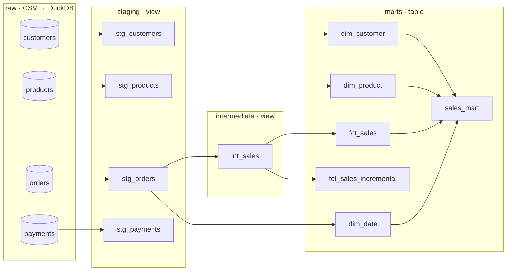

# Retail Analytics Engineering — dbt + DuckDB

[](https://www.getdbt.com/)
[](https://duckdb.org/)
[]()
[]()

Pipeline *analytics engineering* end-to-end untuk data penjualan retail: dari CSV mentah hingga **data mart siap analisis**, dibangun dengan **dbt Core** di atas **DuckDB**. Proyek ini menerapkan layering model (staging → intermediate → marts), **pemodelan dimensional star schema**, **model incremental**, dan **pengujian kualitas data otomatis**.

---

## Latar Belakang

Query analitik yang langsung ditulis di atas tabel operasional cenderung berulang, sulit diuji, dan mudah tidak konsisten antar-laporan. dbt menyelesaikan ini dengan memperlakukan transformasi SQL seperti kode perangkat lunak: termodular, terversi, teruji, dan terdokumentasi.

Proyek ini mensimulasikan kasus toko elektronik dengan data pelanggan, produk, pesanan, dan pembayaran, lalu mengubahnya menjadi model analitik yang bisa langsung dipakai untuk dashboard penjualan.

---

## Arsitektur & Lineage



| Layer | Materialisasi | Fungsi |
| :--- | :---: | :--- |
| **staging** | view | Seleksi & standarisasi kolom dari source `raw` (mis. cast `order_date` ke `date`) |
| **intermediate** | view | Logika bisnis: menghitung `sales_amount = quantity × unit_price` |
| **marts** | table | Dimensi, fakta, dan agregasi siap konsumsi BI |

---

## Model Dimensional (Star Schema)

**`fct_sales`** — *grain*: satu baris per order line, dikelilingi tiga dimensi:

| Tabel | Kunci | Isi |
| :--- | :--- | :--- |
| `fct_sales` | `order_id` | tanggal, customer, produk, quantity, unit price, `sales_amount` |
| `dim_customer` | `customer_id` | nama, segment, region |
| `dim_product` | `product_id` | nama, kategori, department, harga |
| `dim_date` | `full_date` | year, month, quarter |

**`sales_mart`** menggabungkan fakta dan ketiga dimensi menjadi agregasi **total sales & quantity per bulan × segment × region × kategori produk**.

---

## Model Incremental

`fct_sales_incremental` memakai `materialized='incremental'` dengan `unique_key='order_id'`. Pada run berikutnya, hanya baris dengan `order_date >= max(order_date)` di tabel target yang diproses, lalu di-*merge* berdasarkan `order_id` sehingga tidak ada duplikasi.

```sql
{{ config(materialized='incremental', unique_key='order_id') }}
select ... from {{ ref('int_sales') }}

where order_date >= (select coalesce(max(order_date), cast('1900-01-01' as date)) from {{ this }})

```

---

## Pengujian Kualitas Data

11 *generic test* didefinisikan di `models/schema.yml`:

| Model | Kolom | Test |
| :--- | :--- | :--- |
| `dim_customer` | `customer_id` | `unique`, `not_null` |
| `dim_product` | `product_id` | `unique`, `not_null` |
| `fct_sales` | `order_id` | `unique`, `not_null` |
| `fct_sales` | `customer_id` | `not_null`, `relationships` → `dim_customer` |
| `fct_sales` | `product_id` | `not_null`, `relationships` → `dim_product` |

Test `relationships` memastikan integritas referensial: tidak ada transaksi yang menunjuk ke pelanggan atau produk yang tidak ada.

---

## Hasil

| Pengujian | Hasil |
| :--- | :--- |
| Data mentah | 50 customers · 30 products · 500 orders · 500 payments (Jan–Jun 2026) |
| `dbt build` | **21/21 PASS** — 10 model + 11 test, 0 error |
| `dim_date` | 170 tanggal unik |
| `sales_mart` | 303 baris agregasi · total sales **219.137,5** · 1.549 unit terjual |
| Kategori teratas | Printer (39.287,5) · Keyboard (38.267,5) · Monitor (37.465,0) |
| Simulasi incremental | +50 pesanan baru → `fct_sales_incremental` **500 → 550 baris**, 550 `order_id` unik (tanpa duplikat) |

---

## Struktur Proyek

```text
retail-analytics-engineering-dbt/
├── data/                         # CSV mentah (+ orders_incremental.csv untuk simulasi)
├── dbt_project/
│   ├── dbt_project.yml           # Konfigurasi project & materialisasi per layer
│   ├── profiles.yml.example      # Template koneksi DuckDB
│   └── models/
│       ├── staging/              # stg_customers, stg_orders, stg_payments, stg_products
│       ├── intermediate/         # int_sales
│       ├── marts/                # dim_*, fct_sales, fct_sales_incremental, sales_mart
│       └── schema.yml            # Source, dokumentasi kolom, dan test
└── scripts/
    ├── bootstrap_raw.sql         # Load CSV → schema raw (DuckDB CLI)
    ├── run_query.py              # Load raw + verifikasi jumlah baris + query agregasi contoh
    └── simulate_incremental.py   # Tambah 50 pesanan lalu jalankan model incremental
```

---

## Cara Menjalankan

```bash
git clone https://github.com/0Raja0-RA/retail-analytics-engineering-dbt.git
cd retail-analytics-engineering-dbt

python -m venv .venv
# Windows: .venv\Scripts\activate   |   Linux/macOS: source .venv/bin/activate
pip install dbt-duckdb

# 1) Muat CSV ke schema raw di analytics.duckdb
python scripts/run_query.py

# 2) Siapkan profile dbt, lalu build semua model + test
cd dbt_project
cp profiles.yml.example profiles.yml
dbt build --profiles-dir .

# 3) (Opsional) Lihat dokumentasi & lineage graph interaktif
dbt docs generate --profiles-dir .
dbt docs serve --profiles-dir .
```

Simulasi incremental (dari root repo, setelah langkah 2):
```bash
python scripts/simulate_incremental.py
```
> Skrip ini memanggil `.venv\Scripts\dbt.exe` (path Windows). Di Linux/macOS, jalankan manual: insert `data/orders_incremental.csv` ke `raw.orders`, lalu `dbt run --select fct_sales_incremental --profiles-dir .`.

---

## Pengembangan Selanjutnya
* Memodelkan `stg_payments` ke dalam fakta pembayaran dan rekonsiliasi `payment_amount` vs `sales_amount`.
* Memecah kategori produk ke `dim_category` (snowflake schema) bila hierarki produk bertambah.
* Menambah *singular test* untuk aturan bisnis (mis. `quantity > 0`) dan *source freshness*.
